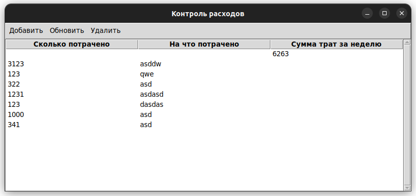
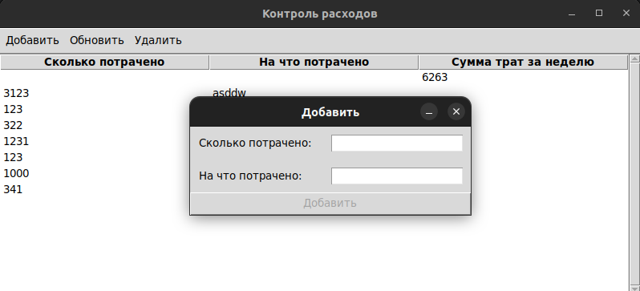
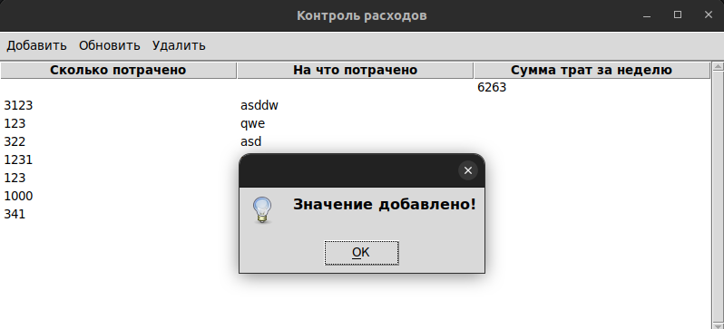
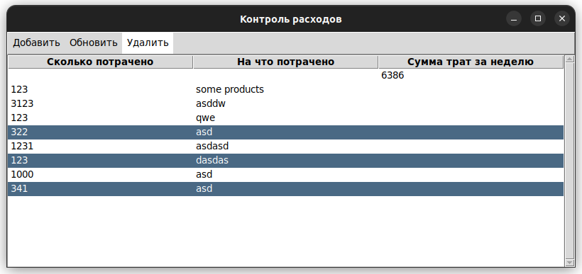

# Costs calculation

This program help you to monitor your costs. When you've purchased something, you can send yourself an email with the costs.
You can send multiple emails. When you will turn on your computer in the evening, this program will launch and calculate your costs. 
At the end of the week, the "costs.xlsx" file is cleared, and the amount spent for the week is recorded in "log.txt"

### Prerequisites

You have to Python and an Excel file application. I use LibreOffice because I work on Ubuntu. 
You must use Excel file from this repository. It is example which work with programm. 


### Installing

First install python

```
sudo apt-get install python3.11
```

and then install pip and library openpyxl

```
sudo apt-get install pip
sudo pip install openpyxl
```
Download the latest release program and run it.

## Deployment

You have to create "pass.txt" and write there your login and password
```
login:my_login
pass:my_pass
```
Also you may create costs.sh
```
#!/bin/bash
cd /home/ubuntu/PycharmProjects/my_costs
python3.11 main.py
```
## GUI_version
<p align="center">

</p>
<p align="center">

</p>
<p align="center">

</p>
<p align="center">

</p>

